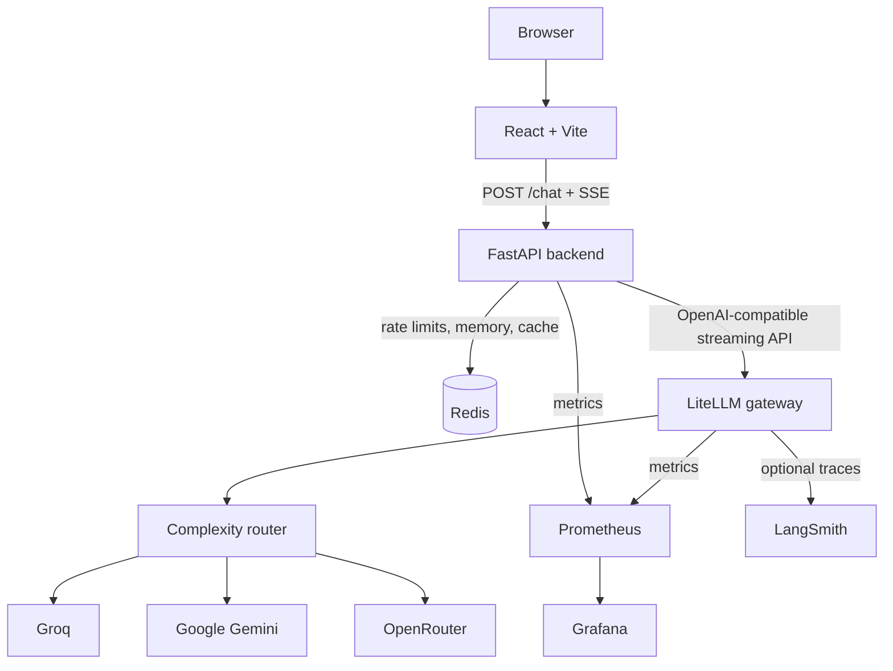

# SmartRoute

SmartRoute is a fault-tolerant, multi-provider LLM chatbot. Every prompt passes through a LiteLLM gateway that selects a free-tier model, retries transient failures, and falls back to another provider when necessary.

It is a learning and portfolio application that demonstrates the parts of a production-shaped LLM application: streaming, conversation memory, caching, safety controls, observability, and graceful failure handling.

## Highlights

- Routes prompts across OpenRouter, Google Gemini, and Groq through LiteLLM.
- Streams answers to the browser with Server-Sent Events (SSE).
- Remembers recent conversation turns per browser session with Redis.
- Caches completed answers only when the message and its preceding context match.
- Retries failed model calls, uses configured fallbacks, and cools down unhealthy deployments.
- Continues a partially streamed response on a recovery model if a provider fails mid-answer.
- Protects the API with an API key, request size limit, fixed-window rate limit, and input guardrail.
- Exposes Prometheus metrics, a Grafana dashboard, and optional LangSmith traces.

## Architecture



### Request lifecycle

1. The React app creates a random session ID for the browser and sends the latest message to `POST /chat`.
2. FastAPI validates the API key and request size, then applies the Redis-backed rate limit.
3. FastAPI loads the session's recent completed turns from Redis.
4. It looks for a Redis cache entry for the normalized message and exactly that preceding conversation. A hit streams the stored answer immediately.
5. For a miss, FastAPI sends the system prompt, saved turns, and latest message to LiteLLM as `smart-router`.
6. LiteLLM scores the prompt, chooses a logical model group, retries transient failures, and follows its fallback list if needed.
7. Tokens travel from the provider through LiteLLM and FastAPI to the browser as SSE events.
8. FastAPI saves a completed exchange to Redis memory, caches eligible responses, and records metrics. LiteLLM can create a LangSmith trace.

## Components

| Component | Role | Connects to |
|---|---|---|
| React + Vite | Chat interface and SSE reader | FastAPI |
| FastAPI | Authentication, context loading, rate limiting, cache, and SSE forwarding | Redis, LiteLLM, Prometheus |
| Redis | Session memory, response cache, rate-limit counters | FastAPI |
| LiteLLM | Provider gateway, routing, retry, fallback, cooldown, guardrail | Providers, Prometheus, LangSmith |
| OpenRouter, Gemini, Groq | Free-tier model providers | LiteLLM |
| Prometheus | Collects numeric service metrics | FastAPI, LiteLLM, Grafana |
| Grafana | Displays the provisioned health dashboard | Prometheus |
| LangSmith | Optional per-request LLM traces | LiteLLM |

## Feature implementation

| Feature | Implementation |
|---|---|
| Automatic routing | FastAPI always requests `smart-router`. LiteLLM's complexity router maps the prompt score to a logical model group. |
| Retry, fallback, cooldown | [litellm/config.yaml](litellm/config.yaml) retries once, follows per-group fallback lists, and skips a failed deployment for 30 seconds. |
| Streaming | FastAPI returns `text/event-stream`. The frontend uses `fetch` and a stream reader because requests need a POST body and API-key header. |
| Conversation memory | The browser keeps a random ID in local storage. Redis retains the latest completed turns under `memory:<session-id>`. |
| Response cache | Redis stores completed, unrecovered answers for `CACHE_TTL`. Its SHA-256 key includes normalized message and prior context, preventing cross-context answers. |
| Mid-stream recovery | If text was already sent and a provider fails, FastAPI passes the context and partial answer to `RECOVERY_MODEL`, then streams only the continuation. |
| Input guardrail | LiteLLM's pre-call filter masks emails and phones and blocks configured sensitive data, prompt injection, and harmful content before provider calls. |
| Rate limit | Redis uses a fixed-window counter per API key. Requests above the configured limit receive HTTP 429. |
| Observability | FastAPI and LiteLLM export Prometheus metrics, Grafana provisions a dashboard, and LiteLLM can send traces to LangSmith. |

## Routing

Application code uses logical model groups. Provider-specific IDs stay in [litellm/config.yaml](litellm/config.yaml), so FastAPI has no provider-specific code.

| Complexity tier | Logical group | Primary provider | Fallbacks |
|---|---|---|---|
| SIMPLE | `general-model` | Groq | Gemini, OpenRouter |
| MEDIUM | `research-model` | Gemini | OpenRouter, Groq |
| COMPLEX | `coding-model` | OpenRouter | Groq, Gemini |
| REASONING | `reasoning-model` | OpenRouter | Gemini, Groq |

The router uses heuristics, so an occasional unexpected tier is normal. The configured thresholds are tuned for this demo.

## Services

| Service | Address | Use |
|---|---|---|
| Chat UI | http://localhost:3000 | Use the chatbot |
| FastAPI | http://localhost:8000 | `GET /health`, `GET /metrics`, `POST /chat` |
| LiteLLM | http://localhost:4000 | Gateway API and metrics |
| Prometheus | http://localhost:9090 | Inspect collected metrics |
| Grafana | http://localhost:3001 | View the dashboard |

## Run locally

Read [Local development](docs/local-development.md) for Docker Compose and non-Docker setup, environment variables, verification, and troubleshooting.

The short Docker path is:

```bash
cp .env.example .env
# Fill in the application keys and at least one provider key in .env.
docker compose up --build
```

Open http://localhost:3000 after the services start.

## Project structure

```text
chatbot-backend/    FastAPI application and tests
chatbot-frontend/   React chat interface
litellm/            Routing, fallback, guardrail, and callback configuration
monitoring/         Prometheus scrape configuration and Grafana dashboard
docs/               Setup, beginner, and interview documentation
docker-compose.yml  Local multi-service environment
```

## Documentation

- [Local development](docs/local-development.md): setup, configuration, testing, and troubleshooting.
- [Complete project guide](docs/project-guide.md): beginner-friendly explanation of every implemented component and feature.
- [Beginner guide](docs/beginner-guide.md): plain-language explanation of concepts and source files.
- [Interview guide](docs/interview-guide.md): implementation decisions and tradeoffs.
- [Resume bullets](docs/resume-bullets.md): project summary points for a resume.

## Limitations

- Provider free tiers, quotas, and model availability can change.
- The complexity router is heuristic-based, not a trained classifier.
- Conversation memory keeps only the newest 12 completed turns and expires after 24 hours by default.
- Redis has no persistent Docker volume, so memory and cache are lost if the Redis container is removed.
- The shared API key is embedded in the local-demo frontend bundle. This is unsuitable for deployment.
- The project is not load tested and has no TLS, user authentication, or secrets manager.

## Future improvements

Per-user authentication and limits, persistent conversation storage, semantic caching, another recovery attempt, alerting rules, HTTPS, a secrets manager, and load testing.
