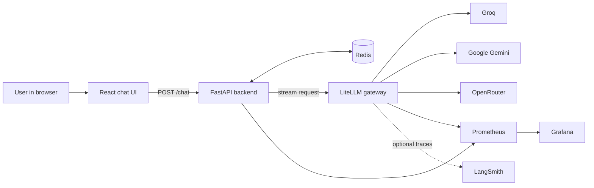

# SmartRoute: complete beginner-friendly guide

This guide explains what SmartRoute does, why each piece exists, and how all of the pieces work together. It assumes you know basic programming terms such as a function, a web request, and an environment variable.

## 1. What is SmartRoute?

SmartRoute is a chat application that can ask several LLM providers for an answer. Instead of the frontend calling a model provider directly, it sends every request to this application's FastAPI backend.

The backend uses LiteLLM as a gateway. LiteLLM chooses a configured model, retries temporary failures, and can move to another provider if the first one fails. This gives the application one stable API even though the real answer can come from Groq, Google Gemini, or OpenRouter.

The project also adds the application features an LLM gateway does not own: browser chat UI, conversation memory, response cache, rate limit, API authentication, request validation, application metrics, and a recovery path for a failure that happens after an answer has started streaming.

## 2. The big picture



There are two important paths in this diagram:

1. **The chat path**: browser → FastAPI → LiteLLM → provider → FastAPI → browser.
2. **The support path**: FastAPI uses Redis for fast temporary state, while Prometheus, Grafana, and LangSmith help you understand what happened.

## 3. Components, explained simply

| Component | What it is | Why this project uses it |
|---|---|---|
| React + Vite | The browser user interface | Shows the chat, receives streamed text, and restores prior messages after a refresh. |
| FastAPI | The Python web server | Owns app rules: authentication, request checks, Redis operations, and SSE responses. |
| LiteLLM | An LLM gateway | Gives several providers one OpenAI-compatible API and handles model routing, retries, fallbacks, cooldowns, guardrails, and callbacks. |
| Redis | A fast temporary data store | Holds rate-limit counters, response-cache entries, and recent session memory. |
| Groq, Gemini, OpenRouter | LLM providers | Supply the actual models that generate answers. |
| Prometheus | A metrics database | Periodically collects numeric health data from FastAPI and LiteLLM. |
| Grafana | A dashboard application | Graphs the Prometheus metrics. |
| LangSmith | An LLM tracing service | Optionally records individual model calls, prompts, responses, token counts, and errors. |
| Docker Compose | Local multi-service launcher | Starts all local services with one command and gives them a shared network. |

## 4. What happens when a user sends a message?

Imagine the user asks: **“What is Redis?”**

1. `Chat.jsx` adds the user's bubble and an empty assistant bubble to the screen.
2. `api.js` sends `POST /chat` to FastAPI. The JSON includes the text and a browser session ID.
3. `main.py` checks the `X-API-Key`, rejects an oversized body, and applies the Redis rate limit.
4. `memory.py` loads the recent completed turns for that session.
5. `streaming.py` checks Redis for a cached response that matches both the current message and the loaded history.
6. If no cached response exists, `chat.py` builds a model-message list: system instruction, saved conversation, then latest user message.
7. `chat.py` asks LiteLLM for `smart-router`. It does not name Groq, Gemini, or OpenRouter directly.
8. LiteLLM scores the prompt's complexity and sends it to a matching configured provider/model.
9. Provider text travels back in small chunks. FastAPI turns each chunk into an SSE event and the React app appends it to the assistant bubble.
10. When the answer finishes, FastAPI saves the user/assistant exchange to memory, caches an eligible response, records metrics, and sends a final `done` event.

## 5. Frontend and streaming

### Why streaming exists

LLM responses can take several seconds. Waiting for the full answer would make the chat look frozen. Streaming sends text pieces as soon as the model produces them, creating the familiar typing effect.

### Why this project uses SSE

FastAPI sends a response with `Content-Type: text/event-stream`. Each event has this shape:

```text
data: {"type":"token","text":"Redis is "}

data: {"type":"token","text":"an in-memory database."}
```

The event types are:

| Event | Meaning |
|---|---|
| `meta` | Provider, route, model, retry count, fallback count, and router details are known. |
| `token` | Another piece of answer text. |
| `done` | The answer finished, with latency, token, cost, cache, and recovery details. |
| `blocked` | The input guardrail rejected the prompt before any provider call. |
| `error` | Every provider path failed, or a failure could not be recovered. |

Browser `EventSource` cannot send a POST body or custom API-key header, so [chatbot-frontend/src/api.js](../chatbot-frontend/src/api.js) uses `fetch` and reads the response stream manually.

## 6. Conversation memory

### What problem does memory solve?

LLMs do not automatically remember earlier HTTP requests. Without memory, these two messages are unrelated:

```text
User: My name is Ada.
Assistant: Nice to meet you, Ada.
User: What is my name?
```

The second user message only works if the backend sends the earlier exchange to the model again.

### How SmartRoute remembers

1. On its first load, [App.jsx](../chatbot-frontend/src/App.jsx) creates a random browser session ID and stores it in `localStorage`.
2. Every chat request includes it as `session_id`.
3. After a successful response, [memory.py](../chatbot-backend/app/memory.py) saves two Redis list items:

   ```json
   {"role":"user","content":"My name is Ada."}
   {"role":"assistant","content":"Nice to meet you, Ada."}
   ```

4. The next request loads those items and puts them before the latest user message in the model input.
5. `GET /chat/history?session_id=...` lets the frontend restore the visible conversation after a browser refresh.

### Limits and expiry

Memory intentionally has limits:

| Setting | Default | Why it exists |
|---|---:|---|
| `MEMORY_MAX_TURNS` | `12` | Stops the prompt from growing forever and consuming the model context window. |
| `MEMORY_TTL` | `86400` seconds | Automatically removes inactive conversations after 24 hours. |
| `MEMORY_ENABLED` | `true` | Lets you turn the feature off without code changes. |

Redis key format:

```text
memory:<random-browser-session-id>
```

Memory survives a backend restart as long as Redis keeps running. It does **not** survive deleting the Redis container because the current Docker Compose file does not mount a persistent Redis volume.

### What memory deliberately does not do

- It does not store failed or blocked requests.
- It does not save a response until the full stream succeeds or recovers.
- It does not create user accounts or share a conversation across devices.
- It is short-term context, not a permanent user-profile system or vector database.

## 7. Response cache

### What is a cache?

A cache keeps a finished answer for a short time. If exactly the same request arrives again, the backend can return the stored answer immediately instead of spending provider quota and waiting for a model.

### Why cache keys include history

In a single-turn chatbot, this key can be based only on the message:

```text
What is Redis?
```

With conversation memory, the same words can mean different things:

```text
User: Tell me about Redis.
User: Give a shorter answer.
```

The second message needs the earlier context. SmartRoute therefore hashes both the normalized latest message and all saved previous turns. An answer from one conversation cannot be returned in a different conversation context.

Redis key format:

```text
cache:<sha256 of normalized message and history>
```

### Cache rules

- Only completed answers are cached.
- A mid-stream recovered answer is not cached because it was produced by more than one model call.
- Cache entries expire after `CACHE_TTL`, which defaults to 300 seconds.
- Redis failure does not break chat. The backend logs a warning and calls the model normally.
- Cache hits still become part of conversation memory, so later messages have the correct context.

Because history changes after each completed turn, repeated questions in a normal ongoing chat often miss the cache. That is expected and keeps answers context-correct. First-turn prompts and requests with identical preceding context can hit the cache.

## 8. Rate limiting

Rate limiting protects provider quota and prevents one API key from sending unlimited requests.

SmartRoute uses a **fixed window**. With the defaults, an API key may send 10 messages in 60 seconds.

Redis key format:

```text
rate:<sha256 of API key>:<current window number>
```

For every request, the backend increments this number. If it becomes larger than `RATE_LIMIT_REQUESTS`, FastAPI returns HTTP 429 before Redis memory or LiteLLM are used.

A fixed window is simple but permits a small burst around the boundary between windows. A sliding-window or token-bucket limiter would be a future improvement.

## 9. Authentication and request validation

### API key

The frontend includes the configured `API_KEY` in the `X-API-Key` request header. FastAPI compares it with the configured server value. A missing or incorrect key receives HTTP 401.

This is acceptable only for a local demonstration: a `VITE_` value is included in browser code. A deployed version needs per-user authentication and server-side secrets.

### Request size and shape

- `main.py` rejects a request body above 16,000 bytes with HTTP 413.
- `ChatRequest` accepts a `message` with 1 to 4,000 characters.
- `session_id` is optional and limited to 128 characters.
- Invalid JSON fields receive FastAPI's HTTP 422 validation response.

## 10. LiteLLM routing, retries, and fallbacks

### Logical names versus real models

The FastAPI backend asks only for `smart-router`. It does not know which provider is chosen.

[litellm/config.yaml](../litellm/config.yaml) contains the real provider model IDs and logical names such as `general-model`, `coding-model`, and `research-model`. To change a provider model, edit the YAML configuration instead of backend Python code.

### Complexity routing

LiteLLM's complexity router uses prompt heuristics such as length, code markers, technical terms, and reasoning language. It selects one of these tiers:

| Tier | Logical group | Primary provider |
|---|---|---|
| SIMPLE | `general-model` | Groq |
| MEDIUM | `research-model` | Gemini |
| COMPLEX | `coding-model` | OpenRouter |
| REASONING | `reasoning-model` | OpenRouter |

This is not a trained classifier. It is fast and useful for a demo, but it can choose an unexpected tier.

### Retry, fallback, and cooldown

These three terms solve different problems:

| Mechanism | What happens | When it helps |
|---|---|---|
| Retry | Try the same deployment again. | A short-lived network or provider error. |
| Fallback | Try another configured provider/model. | A provider is rate limited or unavailable. |
| Cooldown | Temporarily skip a deployment after failures. | Prevents sending every new request to a known-broken provider. |

The configuration retries once, uses ordered group fallbacks, and applies a 30-second cooldown after the configured failure threshold.

## 11. Guardrail

The guardrail is configured in LiteLLM and runs **before** routing. A blocked prompt never reaches Groq, Gemini, or OpenRouter.

| Action | Examples |
|---|---|
| Mask and continue | Email addresses and US phone numbers. |
| Block | US social-security numbers, payment-card patterns, cloud keys, GitHub tokens, prompt-injection patterns, and configured harmful-content categories. |

When LiteLLM rejects a prompt, FastAPI converts the gateway error into an SSE `blocked` event. The frontend displays the reason and Prometheus increments `llm_guardrail_blocked_total`.

This guardrail is pattern and keyword based. It is useful as a first layer, but it can have false positives and cannot replace comprehensive safety review or output moderation.

## 12. What happens when failures occur?

| Situation | Result |
|---|---|
| Provider returns a 429, 5xx, timeout, or connection error before output | LiteLLM retries, then follows the fallback list. |
| All configured providers fail before output | FastAPI streams a friendly `error` event. |
| Provider fails after sending some text | FastAPI calls `RECOVERY_MODEL` with the question, context, and partial answer, then streams its continuation. |
| Prompt is blocked | FastAPI streams a `blocked` event; no provider is called. |
| Too many requests | FastAPI returns HTTP 429 before the model path. |
| Redis is unavailable | Memory, cache, and rate limiting fail open with warnings; chat can still call LiteLLM. |

Mid-stream recovery is best effort. The recovery model can slightly repeat or change the answer, and the project makes only one recovery attempt.

## 13. Metrics, Grafana, and LangSmith

### Prometheus metrics

The backend exposes `GET /metrics`. Prometheus scrapes it and LiteLLM's metrics endpoint.

| Metric | Measures |
|---|---|
| `llm_requests_total` | Requests by route, provider, and outcome. |
| `llm_requests_failed_total` | Requests that ended in an error. |
| `llm_request_duration_seconds` | Request latency distribution. |
| `llm_fallback_total` and `llm_retry_total` | Gateway resilience activity. |
| `llm_cache_hits_total` and `llm_cache_misses_total` | Cache effectiveness. |
| `llm_rate_limit_total` | Requests rejected by the application limiter. |
| `llm_guardrail_blocked_total` | Prompts blocked before model calls. |
| `llm_provider_errors_total` | Provider failures that happened after streaming began. |
| `llm_tokens_total` and `llm_estimated_cost_usd_total` | Token usage and LiteLLM list-price estimate. |

Metrics use low-cardinality labels such as provider and route. They never use prompts or request IDs as labels because every unique label becomes a new Prometheus time series.

### Grafana

Grafana is automatically configured by the files under `monitoring/grafana/`. Open http://localhost:3001 to see request counts, error rate, p95 latency, fallbacks, retries, cache hits, rate limits, routes, and providers.

### LangSmith

When `LANGSMITH_API_KEY` is configured, LiteLLM records per-call traces. Traces can include prompts and answers, so do not send sensitive text to a shared LangSmith project. Leave the key empty to disable this integration.

## 14. Source-code map

| Path | Responsibility |
|---|---|
| `chatbot-frontend/src/App.jsx` | Creates the browser session ID and restores saved history. |
| `chatbot-frontend/src/api.js` | Sends `POST /chat`, loads history, and parses SSE events. |
| `chatbot-frontend/src/components/Chat.jsx` | Renders messages and appends streamed tokens. |
| `chatbot-backend/app/main.py` | FastAPI routes, CORS, authentication, request size, rate limiting, and history endpoint. |
| `chatbot-backend/app/models.py` | Validates the chat request JSON. |
| `chatbot-backend/app/memory.py` | Loads and saves per-session Redis conversation memory. |
| `chatbot-backend/app/cache.py` | Creates context-aware cache keys and reads/writes response cache entries. |
| `chatbot-backend/app/rate_limit.py` | Implements Redis fixed-window rate limiting. |
| `chatbot-backend/app/chat.py` | Builds model message lists and makes the only backend LLM call. |
| `chatbot-backend/app/streaming.py` | Orchestrates memory, cache, streaming, recovery, and metrics. |
| `chatbot-backend/app/metrics.py` | Defines Prometheus counters and histogram. |
| `litellm/config.yaml` | Providers, models, routing, fallbacks, guardrail, LangSmith, and LiteLLM metrics configuration. |
| `docker-compose.yml` | Connects the six containers for local use. |
| `monitoring/` | Prometheus target configuration and Grafana dashboard provisioning. |
| `chatbot-backend/tests/` | Offline tests using fake Redis and fake LLM streams. |

## 15. Where to go next

- Use [Local development](local-development.md) to run the project.
- Read [Beginner guide](beginner-guide.md) for a shorter introduction to LLM application terms.
- Read [Interview guide](interview-guide.md) for the tradeoffs behind the implementation.
- Start with [litellm/config.yaml](../litellm/config.yaml) if you want to change models, routing, or fallback order.
